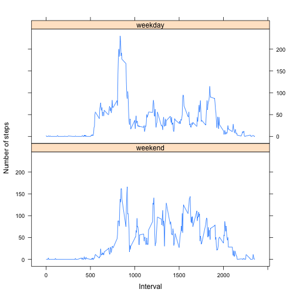

This is a report of an anonymous individual's Activity Monitoring data. The dataset contains the number of steps taken for each 5-minute interval over a 2-month period.

## Loading and preprocessing the data

First we need to load the dataset, which should be available as a zip file in the current directory, which is the base of the github repository. The file is named *activity.zip*. We need to unzip it and then read it as a CSV file into a data frame called *activity*.


```r
unzip("activity.zip")
activity <- read.csv("activity.csv", stringsAsFactors = FALSE)
```

Next we will convert the date field from character strings with a *YYYY-MM-DD* format to Dates, and we will enforce uniform width of interval values by left-padding with zeros. For the *str_pad* function, we first need to load the *stringr* library.


```r
library(stringr)
activity$date <- as.Date(activity$date , "%Y-%m-%d")
activity$interval <- str_pad(activity$interval, width=4, side="left", pad="0")
```

## What is mean total number of steps taken per day?

To determine the total steps taken per day, we will group and summarize using the *dplyr* package (which must already be installed). We will name the new column: **total**.


```r
library(dplyr, warn.conflicts = FALSE)
daily_steps <- summarize(group_by(activity, date), sum(steps, na.rm = FALSE))
names(daily_steps)[2] <-"total"
```

We can now use a histogram to show the distribution of total steps taken per day. Each bin on the X axis corresponds to a range of values (broken up by thousands of steps), and the Y axis value corresonds to the number of days where the total steps taken fits within each bin's range.


```r
hist(daily_steps$total, breaks = 25, xlab = "steps per day", ylab = "number of days in range", main = "Histogram of Steps Taken per Day")
```

 

### Calculating the Mean

Using that new 2-column table, we can calculate the mean steps per day. We need to ignore NA values, and we will round to the nearest integer value.


```r
as.integer(mean(daily_steps$total, na.rm = TRUE))
```

```
## [1] 10766
```

### Calculating the Median

And likewise we can calculate the median.


```r
median(daily_steps$total, na.rm = TRUE)
```

```
## [1] 10765
```

## What is the average daily activity pattern?

Next we need to determine the average per interval, across all days. We group the data based on each 5-minute interval (e.g. 0800 equals 08:00) and then plot a line graph depicting those intervals on the X axis with the average number of steps taken, averaged across all days on the Y axis.


```r
interval_averages <- summarize(group_by(activity, interval), mean(steps, na.rm = TRUE))
names(interval_averages)[2] <- "average"
with(interval_averages, plot(interval, average, type='l'))
```

 

### Finding the Interval with the Max Average Value

To determine the particular interval with the highest average value for steps taken, we can ask for the row that matches the max value for the *average* column. That row's first column value is the interval itself.

First let's check what that max value is.


```r
max(interval_averages$average)
```

```
## [1] 206.1698
```

Now we can find the *interval* value for the row that has that max *average* value.


```r
interval_averages[which(interval_averages$average == max(interval_averages$average)),1]
```

```
## Source: local data frame [1 x 1]
## 
##   interval
## 1     0835
```

Perhaps our anonymous subject walks to work around 08:35 each morning.

## Imputing missing values

Thus far, all of the computations have been working around the fact that there are missing values (NA) for *steps*.

### Determining how many rows have missing values

We can determine how many are missing by counting the rows where the *steps* value is NA.


```r
nrow(activity[is.na(activity$steps),])
```

```
## [1] 2304
```

We can also verify that there are no missing values for the *date* or *interval* fields.


```r
nrow(activity[is.na(activity$date),])
```

```
## [1] 0
```

```r
nrow(activity[is.na(activity$interval),])
```

```
## [1] 0
```

Thus the total number of rows with NAs (as determined by *complete.cases*) should match the number of NAs for the *steps*.


```r
sum(!complete.cases(activity))
```

```
## [1] 2304
```

Indeed, it appears as though we have 2304 rows with missing values, and in all of those cases, the missing value is for the *steps* field.

### Strategy for replacing missing values

We can replace those NA values. In order to provide realistic replacement values, we will use the average of the corresponding interval where each NA occurs. Those are the same averages we plotted above. Here is the function that accomplishes this:


```r
f <- function(x) {
  avg <- as.integer(interval_averages[interval_averages$interval == x[3], 2])
  ifelse(is.na(x[1]), avg, x[1])
}
```

Using that function, we can create a new dataset that is equal to the original dataset but with the missing *steps* data replaced with interval-based averages.


```r
activity2 <- activity
activity2$steps <- as.numeric(apply(activity, 1, f))
```

### Recreating the Histogram now that missing values have been replaced

Now we can revisit the histogram of total number of steps taken each day, and we can see the impact of replacing the missing values.

First we need to recreate the *daily_steps* data frame.


```r
daily_steps2 <- summarize(group_by(activity2, date), sum(steps))
names(daily_steps2)[2] <-"total"
```

Then we can plot the histogram:


```r
hist(daily_steps2$total, breaks = 25, xlab = "steps per day", ylab = "number of days in range", main = "Histogram of Steps Taken per Day (without missing values)")
```

 

The histogram has a similar shape, but it is more pronouned. In other words, with missing values replaced by averages, the less active periods are not artificially inflated as they were when missing values were simply ignored.

### Recalculating Mean steps per day without misssing values

Next we can recalculate the overall mean of steps per day (we no longer need to worry about NA values). The new value is slightly lower because rather than excluding the missing values and having fewer numbers to average, those missing values are now replaced so that the total number (the denonimator of the mean operation) is higher, and apparently the replacement values themselves, being determined by the average per interval where each NA occurred, were lower than the overall average.


```r
as.integer(mean(daily_steps2$total))
```

```
## [1] 10749
```

### Recalculating Median steps per day without misssing values

We can recalucalate the overall median of steps per day as well. It is also lower, but it also has a greater difference from the *mean*.


```r
median(daily_steps2$total)
```

```
## [1] 10641
```

So, it appears as though the impact of imputing missing data on these estimates was significant.


## Are there differences in activity patterns between weekdays and weekends?

We can add a new column to our data frame with an indicator of whether it is a weekend or weekday. That column will be a Factor with 2 values: "weekday" and "weekend"


```r
activity2$datetype <- as.factor({ifelse(weekdays(activity$date) %in% c("Sunday","Saturday"), "weekend", "weekday")})
```

Since we want to compare the interval-based averages between weekdays and weekends, we need to create a grouped data set with those values.


```r
weekdays <- summarize(group_by(activity2[activity2$datetype=="weekday",], interval), as.integer(mean(steps)))
weekdays$datetype = as.factor("weekday")

weekends <- summarize(group_by(activity2[activity2$datetype=="weekend",], interval), as.integer(mean(steps)))
weekends$datetype = as.factor("weekend")

interval_averages2 <- rbind(weekends, weekdays)
names(interval_averages2)[2] <- "average"
```

We can now create a 2-panel plot with the time-series data to compare weekday and weekend activity. We will use the *lattice* library.


```r
library(lattice)
xyplot(average ~ as.integer(interval) | datetype, layout = c(1, 2), data = interval_averages2,
       type = "l", xlab = "Interval", ylab = "Number of steps")
```

 

It appears as though there is a similar pattern of activity, but more mid-day steps are taken on weekends. Sounds familiar.
